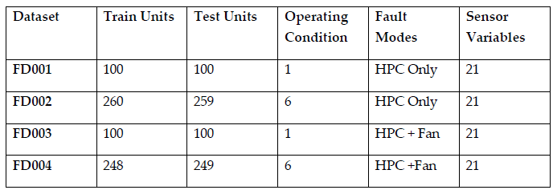
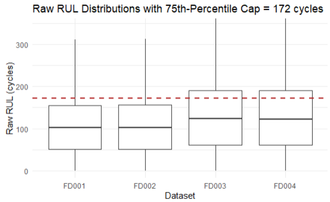
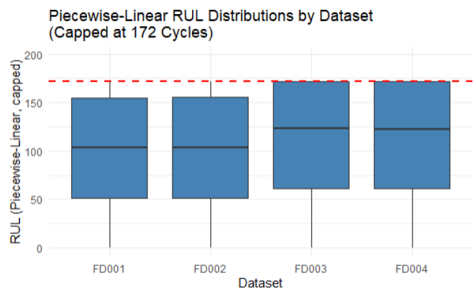
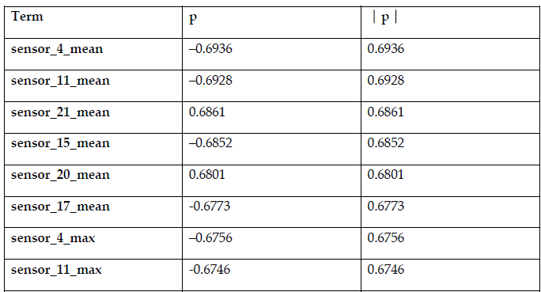
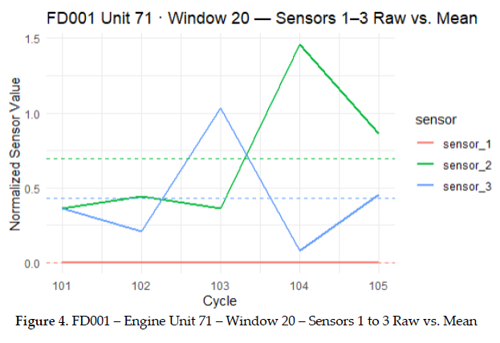
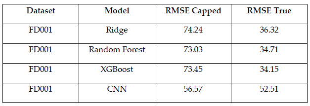

# _Engine RUL Prediction_
A machine learning pipeline for predicting Remaining Useful Life (RUL) in jet engines, benchmarking traditional, ensemble, and deep learning models on NASA’s C-MAPSS dataset.

---
## Project Gallery
<table>
  <tr>
    <td></td>
    <td></td>
    <td></td>
    <td></td>
    <td></td>
    <td></td>
  </tr>
  <tr>
    <td align="center"><i><b>C-MAPSS Dataset Summary:</b> Overview of all four NASA C-MAPSS datasets, including number of units, test/train split, operating conditions, fault modes, and sensor variables. This table highlights key differences in dataset complexity.</i></td>
    <td align="center"><i><b>Raw RUL Distributions:</b> Boxplot showing uncapped Remaining Useful Life (RUL) for all datasets; the dashed red line marks the 75th-percentile cap used for label normalization.</i></td>
    <td align="center"><i><b>Piecewise-Linear (PWL2) RUL Distributions:</b> Boxplot showing capped Remaining Useful Life (RUL) for all datasets; the dashed red line marks the 75th-percentile cap used for label normalization. This approach standardizes RUL targets, mitigates extreme values, and aligns with best practices in prognostics for fair model comparison.</i></td>
    <td align="center"><i><b>Top 8 Engineered Features by RUL Correlation (FD001):</b> Displays the eight windowed features with the highest absolute Spearman correlation to capped RUL in FD001. These features, derived from sliding time windows (mean, max), are selected via genetic algorithm and drive downstream model performance.</i></td>
    <td align="center"><i><b>Sliding-Window Feature Engineering (FD001, Unit 71):</b> Example plot comparing raw and window-mean sensor values (sensors 1–3) for a specific time window. This visualization demonstrates temporal aggregation and smoothing, a key step in capturing degradation trends for RUL prediction.</i></td>
    <td align="center"><i><b>Model Results:</b> Comparison of test set RMSE (both capped and true RUL) for FD001 across Ridge, Random Forest, XGBoost, and 1D-CNN models.</i></td>
  </tr>
</table>

<i>Click any image to view in full resolution.</i>

## Key Features
- **Standardized Data Preprocessing:** Handles missing data, implements piecewise-linear RUL labeling at the 75th percentile, and “first-n-cycles” normalization (`n = 20`) to all features.
- **Sliding-Window Feature Engineering:** Aggregates sensor statistics (mean, sd, min, max) within forward-looking time windows for robust temporal signal extraction.
- **Model-Agnostic, Parallel GA Feature Selection:** Implements a Genetic Algorithm (population 25, 100 generations, tournament size 7, uniform crossover 0.5, mutation 1/p) wrapper for all models, using grouped 3-fold CV (5-fold for feature selection, OOB for RF) on FD001.
- **Model Benchmarking:** Compares Ridge Regression, Random Forest, XGBoost, and 1D-CNN using identical training/testing splits and features, reporting both RMSE on capped and true RUL.
- **Evaluation:** RMSE reported for both capped and true RUL, at average and end-of-life cycles.

## Purpose
Accurate RUL estimation is essential for predictive maintenance in complex engineered systems. This project develops and benchmarks a reproducible ML pipeline for NASA’s C-MAPSS dataset, applying rigorous feature engineering and model-agnostic feature selection to compare regression, ensemble, and deep learning approaches. The work focuses on FD001 due to compute constraints but is extensible to all datasets.

<b><i>Read Project Abstract</i></b>

Accurate estimation of Remaining Useful Life (RUL) is critical for predictive maintenance and risk mitigation in engineered systems. This project originally aimed to benchmark machine learning models for RUL prediction across all four NASA C-MAPSS turbofan datasets (FD001–FD004), utilizing a standardized workflow that integrated data preprocessing, piecewise-linear RUL labeling, normalization, sliding-window feature engineering, and model-agnostic feature selection via a genetic algorithm (GA). However, due to substantial computing and time constraints, the final evaluation was limited to FD001, as detailed in the Limitations section.

Four modeling approaches, Ridge Regression, Random Forest, XGBoost, and one-dimensional convolutional neural networks (1D-CNN), were systematically trained and compared using root mean squared error (RMSE) under both capped and true RUL targets. The results indicate that XGBoost achieved the strongest end-of-life prediction accuracy, with Random Forest and Ridge Regression yielding comparable performance, while 1D-CNN did not surpass the tree-based models on this benchmark. However, 1D-CNN demonstrated better generalization to the end-of-life prediction scenario than its average performance across all training windows might suggest.

These findings underscore the value of a model-agnostic, GA-based feature selection pipeline for fair model comparison and highlight the importance of rigorous, standardized preprocessing in prognostics research. Methodological reflections suggest that rapid prototyping and iterative development confer advantages over traditional linear workflows. Future work will extend this analytical framework to all C-MAPSS datasets to comprehensively evaluate model robustness and generalizability in more complex operational scenarios.

## Tech Stack
- **Languages:** R (RMarkdown & RStudio)
- **Frameworks & Libraries**:
  - Data Analytics & Visualization — `dplyr`, `tidyverse`, `ggplot2`, `corrplot`, `ggcorrplot`
  - Feature Selection — `GA`
  - Modeling:
    - Ridge Regression — `glmnet`
    - Random Forest — `randomForest`
    - XGBoost — `xgboost`
    - 1D-CNN — `keras` (`TensorFlow` backend, integrated via `reticulate`)
  - Parallel Compting — `doParallel`, `parallel`
  - Python Integration — `reticulate`

## Report Access
**[Read the full project report (PDF)](../docs/FinalProjectReport_JackLu_GT.pdf)**

## Current Limitations
- **Hardware and Environment**: GPU acceleration could not be used due to persistent configuration and dependency issues with RStudio, reticulate, and Conda on Windows. All modeling was therefore limited to CPU parallelism.
- **Model Scope**: The BiLSTM model was dropped due to high computational requirements and limited remaining project time.
- **Project Scope**: After a critical system crash toward the end of the project, the analysis was reduced from all four NASA C-MAPSS datasets to only FD001. This scope was further limited by long runtimes, especially during GA-based feature selection.
- **Methodology**: Normalization was fixed at `n = 20` cycles based on literature review without cross-validation or optimal parameter selection, which may affect scaling quality.
- **Literature Review**: Although broad, the literature review was not exhaustive. Some relevant research, especially non-English sources, was not reviewed.

## Future Considerations
- Prioritize addressing the current limitations in future work.
- Revisit GPU-accelerated deep learning implementations using a more stable computing environment.
- Expand the project to include all four NASA C-MAPSS datasets for a comprehensive evaluation of modeling techniques across diverse operational conditions.

## References
- Turbofan Engine Degradation Simulation. [NASA Prognostics Data Repository](https://www.nasa.gov/intelligent-systems-division/discovery-and-systems-health/pcoe/pcoe-data-set-repository/).
- See [full project report](../docs/FinalProjectReport_JackLu_GT.pdf) for additional references.
