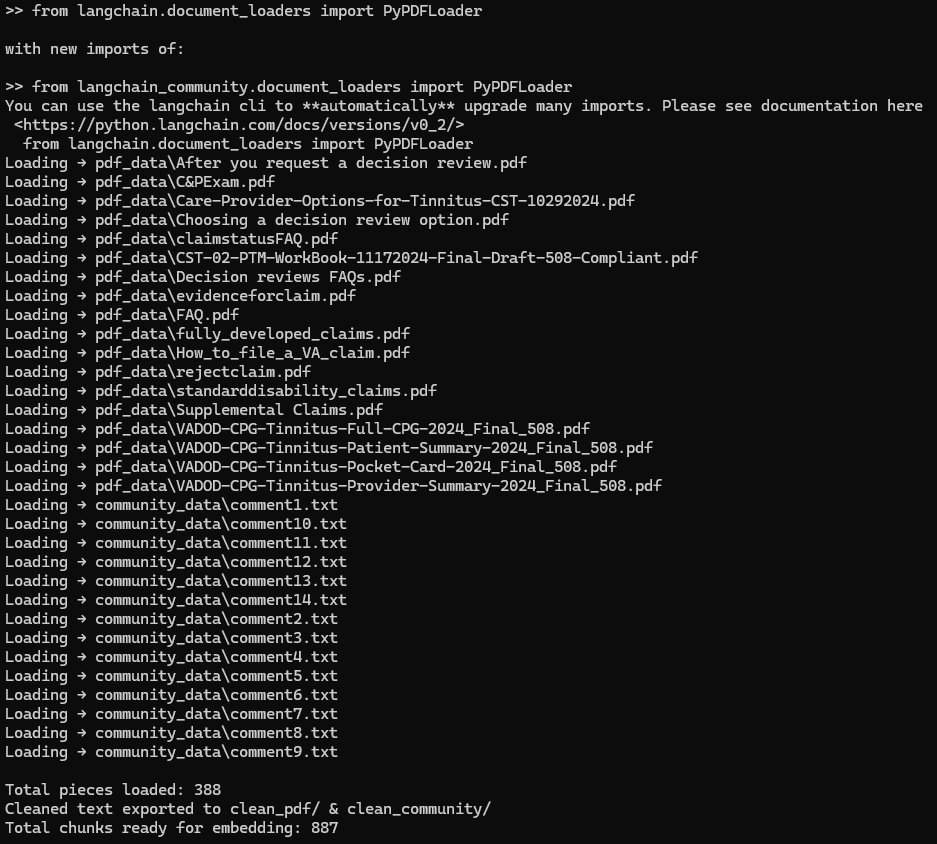
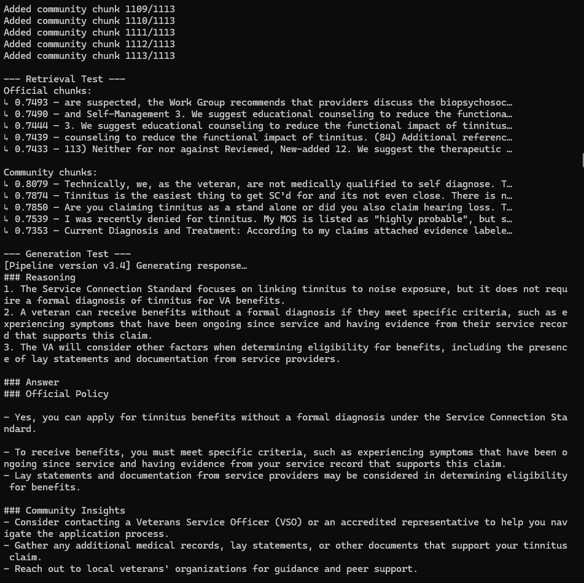

# Jack P. Lu's Data Project Portfolio
Hi, I'm Jack P. Lu, and this repository is a curated collection of my personal data science projects

## Featured Projects

### [VA Helper](./VA-Helper)
_Solo Project_

A Phase 1 RAG prototype assistant combining official VA policy documents with community insights for veterans navigating tinnitus claims.

<table>
  <tr>
    <td></td>
    <td></td>
    <td></td>
    
  </tr>
  <tr>
    <td align="center"><b>Data Loading and Preprocessing:</b> Parsed, cleaned, and segmented source files into 380 document pieces, yielding 858 text chunks ready for vector retrieval </td>
    <td align="center"><b>Retrieval and Generation:</b> Vectorized 858 text chunks, then retrieved and generated both <i>Official Policy</i> and <i>Community Insights</i> answers for the sample query: “Can I apply for tinnitus benefits without a formal diagnosis?” </td>
    <td align="center"><b>Prompt Engineering Snippet:</b> System and user-side prompt templates instruct the LLM to generate clear, actionable, and context-specific responses. Clearly separating official policy from veteran community insights. </td>
  </tr>
</table>

<i>Click any image to view in full resolution.</i>

**Tech Stack:** Python · LangChain · Ollama · Streamlit

### Vibe Check (private repo)
_Team project (4)_  **Role:** Project manager and technical contributor — led evaluation design, coordinated team communication, and supported UI development.

Developed a two-tier sentiment analysis pipeline (VADER + Google Cloud NLP) and a personalized venue recommendation engine with interactive “vibe weight” sliders and a map-based UI, achieving 78% Precision@3 in vibe tagging and 62% sentiment classification accuracy on the Yelp Open Dataset.

**[Read the full project report (PDF)](./docs/team020report.pdf)**

<table>
  <tr>
    <td></td>
    <td></td>
    <td></td>
    <td></td>
  </tr>
  <tr>
    <td align="center">Vibe Check Pipeline Diagram</td>
    <td align="center">List View (Full App)</td>
    <td align="center">Map View (Pin Hovered)</td>
    <td align="center">Map View (Pin Clicked)</td>
  </tr>
</table>

<i>Click any image to view in full resolution.</i>

  
   
  <i>Watch the Vibe Check project presentation on YouTube</i>

**Tech Stack:** Python · VADER · Google Cloud NLP · HTML/JavaScript (Leaflet)

**My contributions:**  
- Stepped up as project manager, leading team communication, facilitating meetings, documenting action items, and tracking progress throughout the project
- Took primary responsibility for drafting and assembling the final report and presentation, integrating technical findings with product and design highlights
- Developed the interactive map UI for the front page using Leaflet, including toggle functionality between map and list views  
- Developed the evaluation framework: independently set up the golden dataset labeling process, established the project’s performance metrics (precision@3, tagging accuracy), and document findings 

*Note: This was a collaborative, end-to-end product design and ML project. Repository is private due to course policy

## About

- [LinkedIn](https://linkedin.com/in/jackplu)
