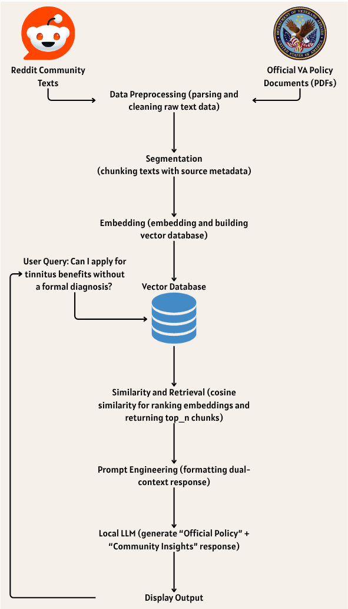
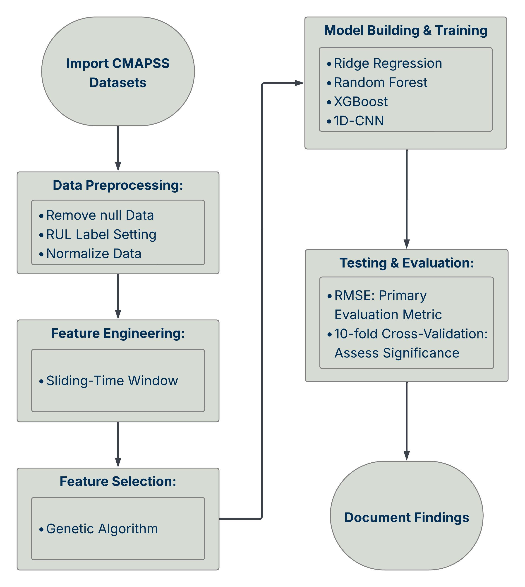
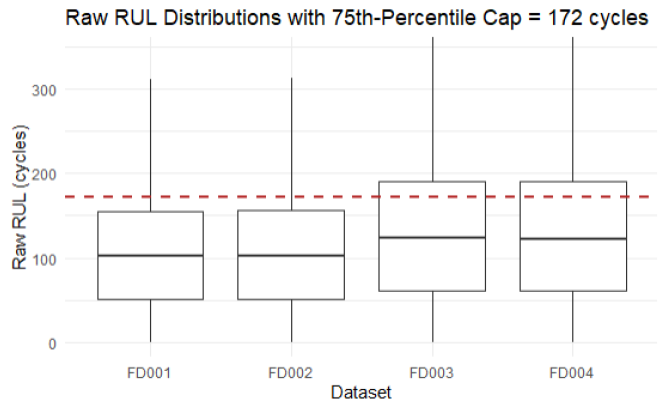
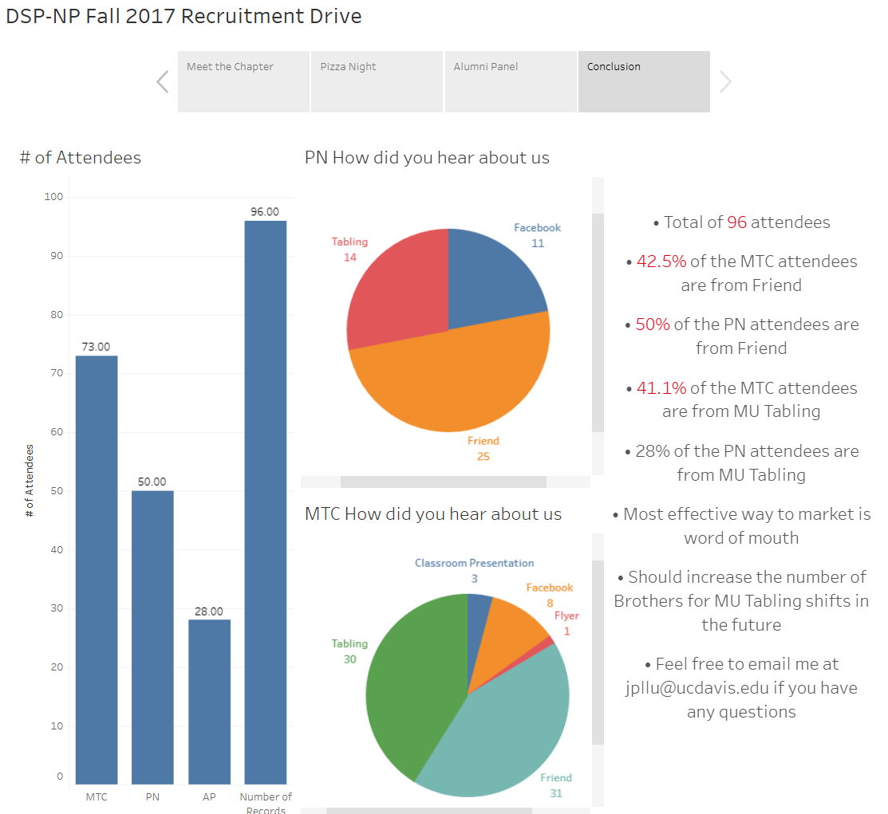

# Jack P. Lu's Data Project Portfolio
Hi, I'm Jack P. Lu, and this repository is a curated collection of my personal data science projects

## Featured Projects

### [VA Helper: Retrieval-Augmented Assistant for Tinnitus Claims](./VA-Helper)
_Solo Project_

A Phase 1 RAG prototype assistant combining official VA policy documents with community insights for veterans navigating tinnitus claims.

<table>
  <tr>
    <td></td>
    <td></td>
    <td></td>
    <td></td>
  </tr>
  <tr>
    <td align="center"><b>VA Helper Pipeline Diagram:</b> End-to-end workflow showing how VA Helper processes policy documents and community texts, retrieves relevant context, and generates structured answers to user queries</td>
    <td align="center"><b>Data Loading and Preprocessing:</b> Parsed, cleaned, and segmented source files into 388 document pieces, yielding 887 text chunks ready for vector retrieval </td>
    <td align="center"><b>Retrieval and Generation:</b> Vectorized 1113 text chunks, then retrieved and generated both <i>Official Policy</i> and <i>Community Insights</i> answers for the sample query: “Can I apply for tinnitus benefits without a formal diagnosis?” </td>
    <td align="center"><b>Prompt Engineering Snippet:</b> Example of a structured system prompt directing the LLM to reason step-by-step and format answers into “Official Policy” and “Community Insights,” following custom formatting and tone guidelines.
  </i> </td>
  </tr>
</table>

<i>Click any image to view in full resolution.</i>

  

  <i>
    <b>Demo:</b> User asks “Can I apply for tinnitus benefits without a formal diagnosis?” and receives a structured answer showing both official VA policy and real-world community insights.
  </i>

**Tech Stack:** Python · LangChain · Ollama · Streamlit

### [Engine RUL Prediction: Machine Learning Models Performance Comparison Study](./Engine_RUL_Prediction)
_Solo Project_

Developed a modular ML pipeline in R to preprocess and model NASA’s C-MAPSS data for Remaining Useful Life (RUL) prediction in turbine engines. Benchmarked traditional, ensemble, and deep learning models on sampled data to evaluate trade-offs in accuracy, interpretability, and generalizability.

**[Read the full project report (PDF)](./docs/FinalProjectReport_JackLu_GT.pdf)**

<table>
  <tr>
    <td></td>
    <td></td>
    <td></td>
  </tr>
  <tr>
    <td align="center"><b>Engine RUL Prediction Pipeline:</b> Overview of the end-to-end workflow for preprocessing, feature engineering, model training, and evaluation on the NASA C-MAPSS dataset.</td>
    <td align="center"><b>Raw RUL Distributions:</b> Boxplot showing uncapped Remaining Useful Life (RUL) for all datasets; the dashed red line marks the 75th-percentile cap used for label normalization.</td>
    <td align="center"><b>Model Results:</b> Comparison of test set RMSE (both capped and true RUL) for FD001 across Ridge, Random Forest, XGBoost, and 1D-CNN models.</td>
  </tr>
</table>

<i>Click any image to view in full resolution.</i>

    
**Tech Stack:** R · Tidyverse · glmnet · randomForest · xgboost · keras · tensorflow · Genetic Algorithms (GA) · Parallel Computing

### Vibe Check: Sentiment-Driven Recommendation System (private repo)
_Team Project (4)_  **Role:** Project manager and technical contributor — led evaluation design, coordinated team communication, and supported UI development.

Developed a two-tier sentiment analysis pipeline (VADER + Google Cloud NLP) and a personalized venue recommendation engine with interactive “vibe weight” sliders and a map-based UI, achieving 78% Precision@3 in vibe tagging and 62% sentiment classification accuracy on the Yelp Open Dataset.

**[Read the full project report (PDF)](./docs/team020report.pdf)**

<table>
  <tr>
    <td></td>
    <td></td>
    <td></td>
    <td></td>
  </tr>
  <tr>
    <td align="center">Vibe Check Pipeline Diagram</td>
    <td align="center">List View (Full App)</td>
    <td align="center">Map View (Pin Hovered)</td>
    <td align="center">Map View (Pin Clicked)</td>
  </tr>
</table>

<i>Click any image to view in full resolution.</i>

  
   
  <i>Watch the Vibe Check project presentation on YouTube</i>

**Tech Stack:** Python · VADER · Google Cloud NLP · HTML/JavaScript (Leaflet)

**My contributions:**  
- Stepped up as project manager, leading team communication, facilitating meetings, documenting action items, and tracking progress throughout the project
- Took primary responsibility for drafting and assembling the final report and presentation, integrating technical findings with product and design highlights
- Developed the interactive map UI for the front page using Leaflet, including toggle functionality between map and list views  
- Developed the evaluation framework: independently set up the golden dataset labeling process, established the project’s performance metrics (precision@3, tagging accuracy), and document findings 

*Note: This was a collaborative, end-to-end product design and ML project. Repository is private due to course policy

### San Francisco Traffic Collision Data Analysis(./San%20Francisco%20Traffic%20Collision%20Data%20Analysis)
_Solo Project_

Performed EDA in Jupyter using Python (Pandas, NumPy) of San Francisco bicycle & pedestrian collisions (2006–2022) using [SFCTA data](https://safety.sfcta.org/). Investigates **Vision Zero (2014)** trend shifts, **street-level risk**, and **mode severity** (pedestrian vs. bicycle) with static charts and interactive maps.

[Open in Google Colab](./San%20Francisco%20Traffic%20Collision%20Data%20Analysis/SanFranciscoTrafficCollisionDataAnalysis.ipynb)

[View on nbviewer](https://nbviewer.org/github/plu210/My-Data-Portfolio/blob/main/San%20Francisco%20Traffic%20Collision%20Data%20Analysis/SanFranciscoTrafficCollisionDataAnalysis.ipynb)

<table>
  <tr>
    <td></td>
    <td></td>
    <td></td>
    <td></td>
    <td></td>
  </tr>
  <tr>
    <td align="center"><b>Number of Collisions Per Year (Pre vs Post Vision Zero):</b> Average annual % change in collisions was +7.01% (2008–2014) and −5.07% (2014–2020), indicating a shift that may be associated with Vision Zero’s rollout.</td>
    <td align="center"><b>Fatalities Per Collision on Top 5 Streets:</b> MISSION ST: 3.06%, MARKET ST: 2.44%, GEARY BLVD: 4.64%, FOLSOM ST: 2.37%, POLK ST: 1.49%.</td>
    <td align="center"><b>Streets with Highest Fatalities per Collision:</b> Tennessee St and Tulare St each have a 100% fatalities-per-collision rate due to a single fatality on each street from 2006 to 2022, highlighting the need to consider both total deaths and rate for context.</td>
    <td align="center"><b>Fatality Rates: Pedestrians vs Cyclists:</b> Pedestrian fatality rate 2.38% vs Cyclist 0.44%</td>
    <td align="center"><b>Collision Incidents Map:</b> Interactive OpenStreetMap layer of San Francisco between 2014-2022 for pedestrain (red) and bicycle (teal)</td>
  </tr>
</table>

<i>Click any image to view in full resolution.</i>

    
**Tech Stack:** Python · Pandas · NumPy · Matplotlib · Plotly Express

*Note: Originally created as course project for CSE 6040: Computing for Data Analytics and included here as a portfolio piece.

## Legacy Projects
### [DSP – NP Fall 2K17 Recruitment Drive]
_Solo Project_

Developed an interactive Tableau dashboard to analyze and visualize recruitment outcomes for Delta Sigma Pi’s Fall 2017 drive at UC Davis. Collaborated with recruitment leadership to define data collection strategy and independently built the dashboard to identify actionable insights. Recommendations based on the analysis supported future event planning and helped increase event attendance by 35% the following academic year.

[View Interactive Dashboard on Tableau Public](https://public.tableau.com/shared/PW8263KM5?:display_count=n&:origin=viz_share_link)

<table>
  <tr>
    <td></td>
  </tr>
  <tr>
    <td align="center"><b>Final Dashboard & Insights:</b> Summary of recruitment outcomes (# of Attendees), channels (“How did you hear about us?”), and actionable recommendations for future outreach. Analysis highlights the importance of word-of-mouth marketing and optimizing MU Tabling resources.</td>
  </tr>
</table>

<i>Click on image to view in full resolution.</i>

**Tech Stack:** Tableau

## About

- [LinkedIn](https://linkedin.com/in/jackplu)
